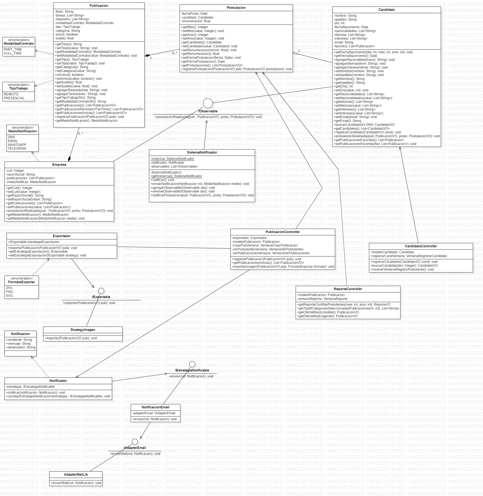
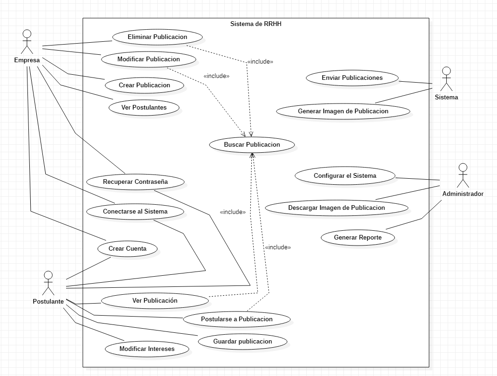

# TPO_ADOOGRUPO6
En este repositorio podrán encontrar un diseño de clases y su implementación en Java de un sistema de bolsa de trabajo. 
Se trata de un trabajo práctico realizado para la materia Análisis y Diseño Orientado a Objetos de la Universidad Argentina de la Empresa (2do cuatrimestre, martes turno noche, 2021).

Informe del trabajo disponible en [este enlace](https://drive.google.com/file/d/1FpfMrwipkdirWVwXdzCBq-Aegb2983-z/view?usp=sharing).

## Consigna
Una  importante  organización  de  RRHH  nos  ha  solicitado  el  diseño  y desarrollo de un sistema de Bolsa de Trabajo.
Toda empresa que quiera realizar una búsqueda laboral deberá generar una Publicación de Oferta Laboral, completando, mínimamente, los siguientes datos:

- Título de la búsqueda: puede estar vacío. Si está vacío, el sistema deberá generar un título de forma automática tomando en cuenta la Categoría, el Tipo de trabajo y Lugar de trabajo. 
- Descripción del puesto: detalle de qué tareas involucra el puesto, de forma narrada y mediante tareas seleccionables a través de un desplegable.
- Modalidad de contrato: puede ser part-time o full-time.
- Tipo de trabajo: puede ser “remoto” o “presencial”. 
- Lugar de trabajo: solamente se deberá completar si el tipo de trabajo es presencial y no se deberá especificar la dirección exacta, sino una referencia.
- Categoría:  categoría  a  la  cual  pertenece  la  búsqueda  laboral  (“Sistemas”,  “Industria  Petrolera”, “RRHH”, “Contable”, entre otras, pueden ser algunos ejemplos).
- Requisitos: serie requisitos que deben cumplir, sin excepción, los postulantes.
- Sueldo ofrecido: monto que se pagará, con determinada frecuencia, al empleado. Cada publicación deberá tener un periodo de vigencia durante el cual estará abierta para la recepción de postulantes.

Fuera de este periodo, deberá figurar por N semanas como “Búsqueda cerrada”. Cabe destacar que, si el puesto ofrecido por una publicación no fue cubierto, la empresa interesada podrá volverla a reabrir.

Las  personas  que  estén  interesadas  en  postularse  en  búsquedas  laborales  deberán  registrarse  en  la plataforma, dejando detalle de:

- Nombre y apellido completo
- Fecha de nacimiento
- Nacionalidades
- Idiomas
- Intereses:  deberá  seleccionar,  por  orden  de  prioridad,  las  Categorías  de  las  publicaciones  que  le interese.

## Diagrama de clases

## Diagrama de Casos de Uso

## Requisitos del sistema (FURPS+)
### Funcionales
- RF01 - El sistema debe permitir que las empresas y postulantes puedan crear una nueva cuenta
- RF02 - El sistema debe permitir que las empresas, postulantes y administradores puedan loguearse al sistema
- RF03 - El sistema debe permitir el recupero de contraseña de cualquier usuario
- RF04 - El sistema debe permitir que las empresas puedan realizar la creación de publicaciones de empleo, indicando como mínimo el título de la búsqueda, la descripción del puesto, la modalidad de contrato, el tipo de trabajo, el lugar de trabajo, la categoría, los requisitos y el sueldo ofrecido.
- RF05 - El sistema debe generar el título de la búsqueda de forma automática tomando en cuenta la Categoría, el Tipo de Trabajo y Lugar de Trabajo, en caso que, al momento de realizar la creación de una publicación de empleo, el mismo esté vacío.
- RF06 - El sistema debe validar que la modalidad de contrato sea “Part-Time” o “Full-Time”, al momento de la creación de una publicación de empleo.
- RF07 - El sistema debe validar que el “Tipo de Trabajo” sea “remoto” o “presencial”, al momento de la creación de una publicación de empleo.
- RF08 - El sistema debe permitir el completado del campo “Lugar de trabajo”, únicamente si fue seleccionado previamente el valor “presencial” en el campo “Tipo de Trabajo”.
- RF09 - El sistema debe cerrar las publicaciones de empleo que excedan el periodo de vigencia.
- RF10 - El sistema debe mostrar, una vez que se cierra una publicación, el estado “Búsqueda cerrada” durante 4 semanas. Una vez finalizado dicho plazo, no deberá visualizarse la publicación.
- RF11 - El sistema debe permitir que las empresas puedan realizar la reapertura de publicaciones de empleo cerradas.
- RF12 - El sistema debe validar que los postulantes, al registrarse, deban ingresar mandatoriamente su Nombre y Apellido completo, su fecha de nacimiento en formato DD/MM/YYYY, sus nacionalidades, los idiomas que maneja y sus intereses en orden de prioridad.
- RF13 - El sistema debe permitir que las empresas puedan visualizar a todos los postulantes para una determinada publicación propia.
- RF14 - El sistema debe permitir que los postulantes puedan postularse en publicaciones de empleo abiertas en caso de cumplir los requisitos
- RF15 - El sistema debe mostrar una alerta popup a los postulantes en caso que intenten postularse a una publicación de empleo la cual no cumplan los requisitos
- RF16 - El sistema debe permitir que los postulantes puedan visualizar publicaciones de empleo cerradas
- RF17 - El sistema debe validar que, al momento de la postulación de un postulante a una publicación, se cargue como archivo su CV y la remuneración pretendida
- RF18 - El sistema debe permitir que los postulantes puedan guardar publicaciones de empleo en Favoritos
- RF19 - El sistema debe permitir que los administradores puedan configurar las tareas que pueden ser seleccionadas como descripción, los idiomas y nacionalidades permitidas para los puestos
- RF20 - El sistema debe generar semanalmente  imágenes en formato JPG/PNG/SVG de publicaciones de ofertas laborales que contenga de forma mandatoria encabezado, cuerpo y pie
- RF21 - El sistema debe permitir que los administradores puedan descargar la imagen generada por el sistema de una publicación de empleo
- RF22 - El sistema debe enviar semanalmente notificaciones recomendadas a postulantes según las publicaciones que hayan guardado en favoritos
- RF23 - El sistema debe enviar una notificación a la empresa una vez se postula un postulante
- RF24 - El sistema debe ser capaz de informar, bajo demanda, la oferta laboral que más postulantes recibió en un mes y/o año
- RF25 - El sistema debe informar bajo demanda las primeras 5 categorías más seleccionadas en las ofertas laborales
- RF26 - El sistema debe informar cual es la oferta abierta "más accesible", considerando como "más accesible" aquel trabajo cuya modalidad es part-time, remoto, con menor cantidad de tareas asignadas y menor cantidad de requisitos
- RF27 - El sistema debe informar cual es la oferta abierta "más exigente", considerando como "más exigente" aquella oferta que tiene la mayor cantidad de requisitos
- RF28 - El sistema debe validar que el CV cargado por el postulante al momento de la postulación contenga formato PDF    
- RF29 - El sistema debe validar que la remuneración pretendida cargada por el postulante al momento de la postulación sea un número positivo
### Usabilidad
- RU01 - El sistema debe permitir que los usuarios naveguen con la tecla Tabulador únicamente sobre elementos interactuables
- RU02 - El sistema debe presentar sugerencias(SmartSearch) a medida que se escribe en la barra de busqueda.
### Fiabilidad
- RR01 - El sistema debe ser capaz de mantener alta disponibilidad 99%
- RR02 - El sistema debe atrapar todos los errores generados, sin generar errores genéricos
- RR03 - El sistema debe mantener un registro/log de operaciones y errores generados
- RR04 - El sistema no debe inhabilitar la aplicación ante un pico de 1000 usuarios concurrentes
- RR05 - El sistema debe, ante cualquier tipo de error, no perder la información que esté sucediendo en una transacción en curso a través del uso de cache
### Performance
- RP01 - El sistema debe responder a cualquier tipo de interacción en un tiempo máximo de 5 segundos
- RP02 - El sistema debe soportar al menos 1000 usuarios concurrentes
- RP03 - El sistema no debe consumir más de 75% de uso de CPU
- RP04 - El sistema no debe consumir más del 50% de uso de memoria RAM
### Mantenimiento
- RS01 - El sistema debe tener un manual de instalación claro y conciso
- RS02 - El sistema debe ser soportado en sistemas basados en Windows 7 en adelante
- RS03 - El sistema debe tener un manual de desinstalación claro y conciso
- RS04 - El sistema debe permitir upgrades y downgrades, sin tener que inhabilitar el sistema
### Requisitos adicionales
- RE01 - El sistema debe seguir las normas ISO 9241-171 (Guidance on Software Accessibility)
- RE02 - El sistema debe tener un apartado que indique Normas de Contratación, Condiciones Legales y Políticas de Privacidad
- RE03 - El sistema debe mostrar los botones de confirmación y cancelación siempre en el mismo sitio
- RE04 - El sistema debe mostrar siempre el botón de confirmación en verde y a la izquierda
- RE05 - El sistema debe mostrar siempre el botón de cancelación en gris y a la derecha
- RE06 - El sistema debe mostrar textos y mensajes con las palabras, frases y conceptos de negocio familiares para el usuario, en lugar de mostrar los términos orientados al sistema
- RE07 - El sistema debe mostrar los mensajes de error en un lenguaje claro, indicando exactamente el problema
- RE08 - El sistema debe mostrar las instrucciones de uso de forma visible y fácilmente accesible en todo momento
